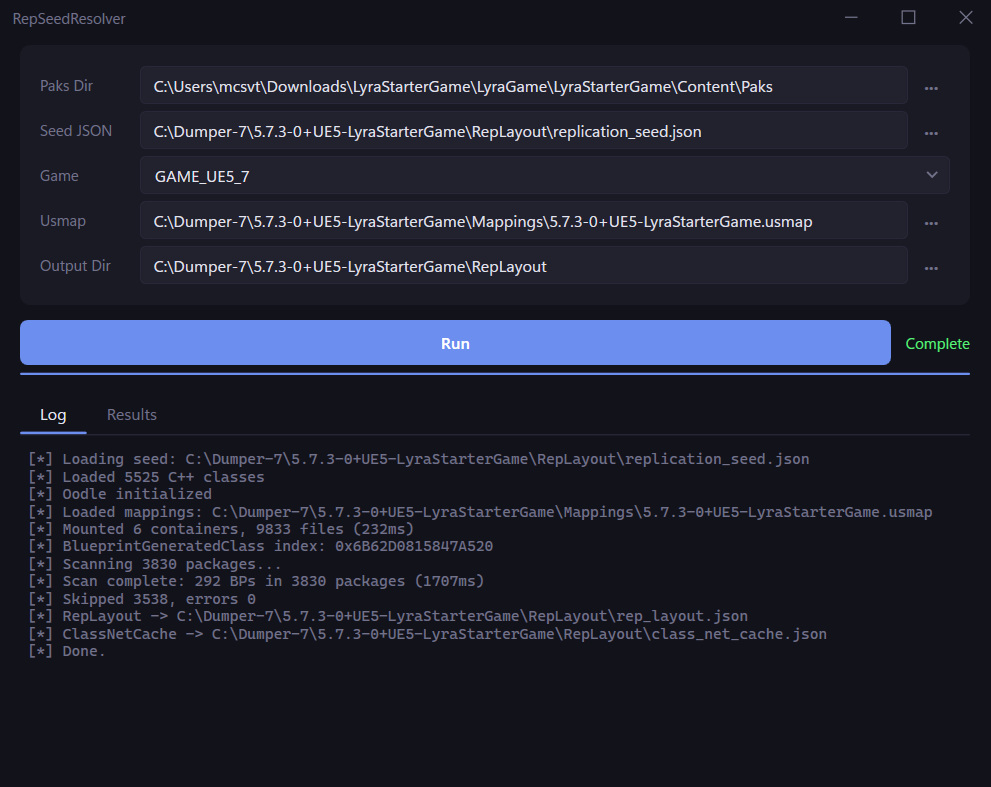
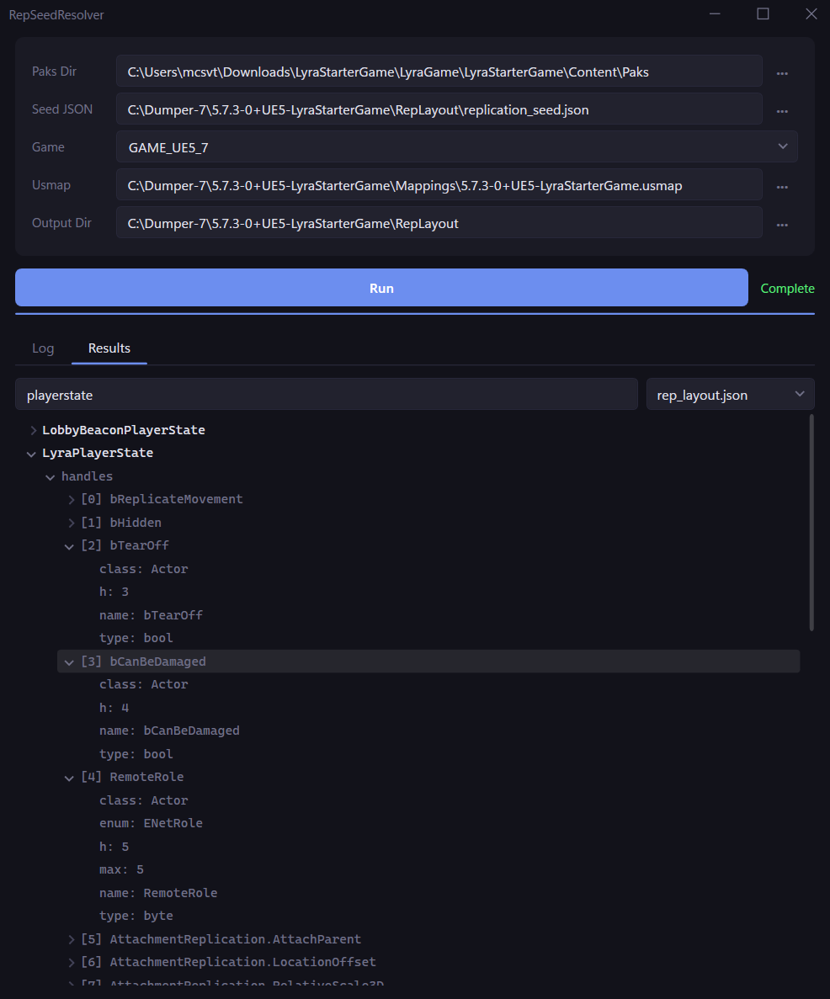

# RepSeedResolver

UE5 Blueprint replication handle & net field resolver, built on [CUE4Parse](https://github.com/FabianFG/CUE4Parse).

Scans `.pak` files to discover Blueprint classes and resolves their replication layout handles and ClassNetCache indices using C++ seed data from [RepSeedDumper](https://github.com/Mokocoder/RepSeedDumper).





## Download

Pre-built binaries are available on the [Releases](https://github.com/Mokocoder/RepSeedResolver/releases) page.

Requires [.NET 8.0 Runtime](https://dotnet.microsoft.com/download/dotnet/8.0) (win-x64).

## Output

Produces two JSON files:

- `rep_layout.json` — Per-class replication property handles with 1-based indices, inheriting from the C++ seed and appending BP-defined replicated properties
- `class_net_cache.json` — Per-class net field export indices, combining seed net fields with BP properties and RPCs

## Build

```
git clone --recurse-submodules https://github.com/Mokocoder/RepSeedResolver.git
dotnet publish -c Release
```

## Usage

1. Set Paks Dir to the game's pak folder
2. Load Seed JSON (`replication_seed.json` from RepSeedDumper)
3. Select Game version
4. (Optional) Load `.usmap` mappings
5. (Situational) If your game uses encrypted pak files, input the 64 Character AES key.
6. Click Run

## How it works

1. CUE4Parse mounts the game's pak files and loads mappings
2. Scans all packages for `UBlueprintGeneratedClass` exports using the global script object index for fast filtering
3. For each BP class, collects replicated properties (`EPropertyFlags::Net`) and net RPCs (`FUNC_Net`)
4. Walks the BP inheritance chain to find the C++ ancestor in the seed data
5. Appends BP handles after the C++ seed handles, preserving UE's `FRepLayout` wire ordering
6. Accumulates net field counts up the chain to produce correct `ClassNetCache` max indices
